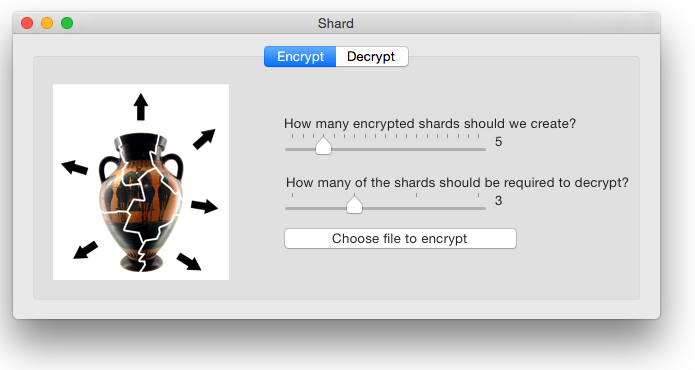
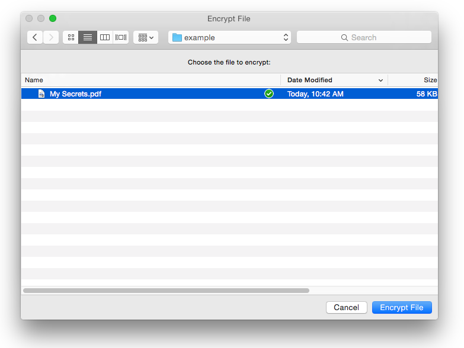
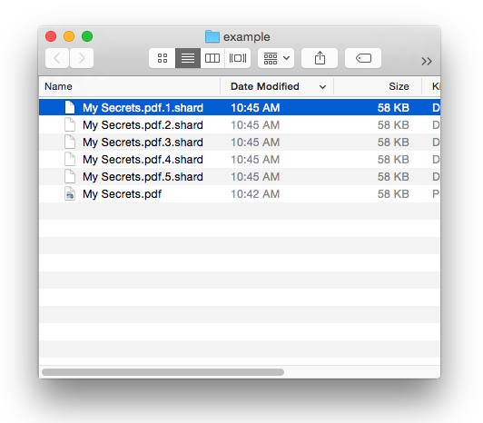
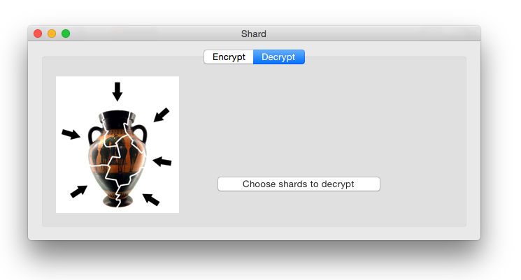
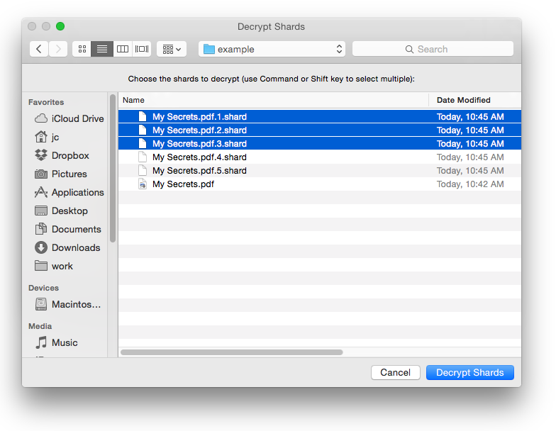

Shard
=====

Shard is an encryption tool that lets you split a file into "shards," so the original file can only be recovered if a certain number of shards are brought back together.

**WARNING:** Shard is experimental software and its security has not yet been verified. Please do not rely on Shard for important documents.

Screenshots
-----------

Technology
----------

Shard uses Shamir secret sharing, as implemented by the libgfshare encryption library written by Daniel Silverstone.

Each shard is the same size as the encrypted file (plus a small header). This size is necessary to offer information-theoretic security, meaning that a person who does not possess enough shards is provably unable to reconstruct any information about the original file. For more on how and why this works, see the libgfshare documentation.

Authors
-------

Shard is a project of the Harvard Library Innovation Lab with support from the Knight Foundation Prototype Fund.